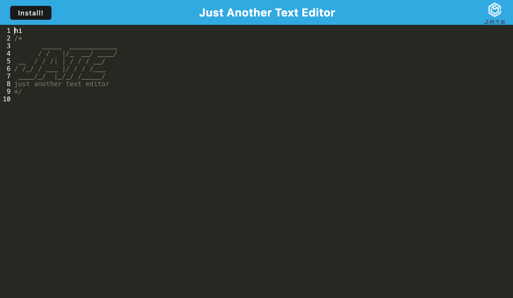

# Text Editor
  

## Description 
    This application is a simple text editor. It allows for the user to take notes. This text editor is also available offline, so you can take notes even if you do not have internet connection. 
## Table of Contents
- [Installation](#installation)
- [Usage](#usage)
- [License](#license)
- [Questions](#questions)
## Installation
    In order to install the application, type command 'npm run install' in the terminal window in order to install all necessary packages within both the client and the server.
    
## Usage
    In order to run this project via localhost, type command 'npm run build' in order to build both the client and server side application. After this type the command 'npm run start' in order to start the application. The terminal will let you know which local host port you will be able to see the application. You can also download the note taker app in order to use it offline. Download the app by clicking the download button. 

## License
The license for this project is MIT
https://opensource.org/license/mit/

    
## Questions
  Contact me at benita.isaac@gmail.com if you have any other questions. Github: 
[https://github.com/benitaisaac](https://github.com/benitaisaac)